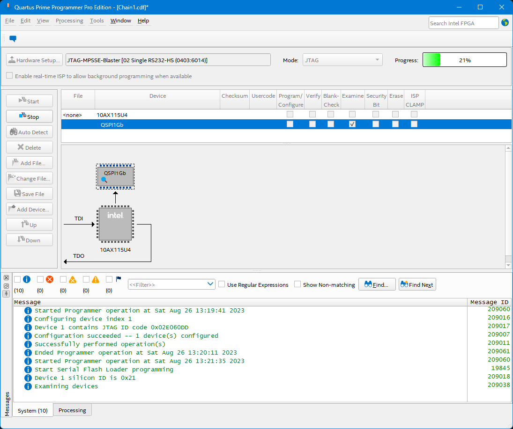
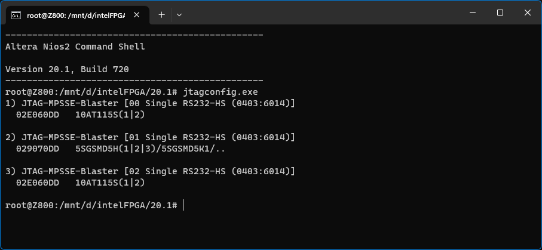

JTAG-MPSSE-Blaster  
==================  

This project allows to use an MPSSE capable FTDI device as a JTAG interface in Quartus tools.  

## Build and installation  

### Windows hosts  
- Ensure that `ftd2xx.dll` is present in the target machine. This step is usually performed in the Windows automatic driver installation process, if needed, it can be downloaded from the [FTDI website](https://ftdichip.com/drivers/d2xx-drivers/).  
- Use Visual Studio to build the `jtag_hw_mpsse.dll` and copy it to `quartus_install_dir/quartus/bin64`.  

### Linux hosts  
- Ensure that `libftd2xx.so` is present in the target machine, if needed, it can be downloaded from the [FTDI website](https://ftdichip.com/drivers/d2xx-drivers/), then copy it to /usr/lib and create a symbolic link.  
```console
$ wget https://ftdichip.com/wp-content/uploads/2022/07/libftd2xx-x86_64-1.4.27.tgz
$ tar -xvf libftd2xx-x86_64-1.4.27.tgz
$ cd release/build
$ sudo cp libftd2xx.so.1.4.27 /usr/lib/
$ sudo chmod 0755 /usr/lib/libftd2xx.so.1.4.27
$ sudo ln -sf /usr/lib/libftd2xx.so.1.4.27 /usr/lib/libftd2xx.so
```

- Copy the provided USB udev rule for the FTDI device. This rule disables the load of VCP kernel driver (ftdi_sio) and allows non-root access to the device.  
```console
$ sudo cp 98-jtag-mpsse-blaster.rules /etc/udev/rules.d/
```

- Reload the new rule or reboot the target system.  
```console
$ sudo udevadm trigger
```

- Install the build tools.  
```console
# Debian based distro
$ sudo apt install build-essential

# Red Hat based distro
$ sudo yum groupinstall "Development tools"
```

- Build the `libjtag_hw_mpsse.so` using the provided Makefile and copy it to the Quartus install path.  
```console
$ make
$ sudo cp libjtag_hw_mpsse.so quartus_install_dir/quartus/linux64/
```

## Code review  
This library targets the FT232H device and has been tested with the Catapult Smartnics described in my other repo: [catapult-v3-smartnic-re](https://github.com/tow3rs/catapult-v3-smartnic-re).  

Several tests have been performed in Mint-21.2 / Fedora-38 / Windows 11-22H2, running Quartus 20.1 / 22.1, the following tools have been checked:  
- Quartus Prime Programmer.  
- The Quartus jtagconfig tool.  
- Nios II Software Build Tools for Eclipse.  

Support for other MPSSE devices such as the FT2232H, FT2232D or the FT4232H can easilly done by adding new entries in the `validDevices` array and creating the matching udev rules for them when used in Linux systems.  
```c
const ValidDevice validDevices[] =
{
	{ .Type = FT_DEVICE_232H, .VID = 0x0403, .PID = 0x6014 },  // Single RS232-HS - (FT232H)
	{ .Type = FT_DEVICE_2232H, .VID = 0x0403, .PID = 0x6012 }, // Dual RS232-HS - (FT2232H/FT2232D)
	{ .Type = FT_DEVICE_4232H, .VID = 0x0403, .PID = 0x6011 }, // Quad RS232-HS - (FT4232H)
};
```
These are the default VID/PID values for FTDI devices when no EEPROM is attached to them. If the device has an EEPROM with custom VID/PID then it can be also added to this array.  

### JTAG test tool  
This tool is a standalone executable and uses the library routines to perform a basic JTAG scan on all available interfaces, then prints the first device IDCode that has been found in the JTAG chain foreach interface.  
The tool can be used to troubleshoot JTAG connectivity problems or easily debug the library code.  
```
Device:         [JTAG-MPSSE-Blaster]

  Port:                 [00 Single RS232-HS (0403:6014)]
  Raw TDO bits:         11111111 11111111 10111011 00000110 00000111 0100000
  Raw TDO bytes:        FF FF DD 60 E0 02
  JTAG IDCode:          02E060DD

  Port:                 [01 Single RS232-HS (0403:6014)]
  Raw TDO bits:         11111111 11111111 10111011 00001110 00001001 0100000
  Raw TDO bytes:        FF FF DD 70 90 02
  JTAG IDCode:          029070DD

  Port:                 [02 Single RS232-HS (0403:6014)]
  Raw TDO bits:         11111111 11111111 10111011 00000110 00000111 0100000
  Raw TDO bytes:        FF FF DD 60 E0 02
  JTAG IDCode:          02E060DD
```  

### TODO List  
Implement the ability to set a custom JTAG TCK frequency. For now the target TCK frequency is harcoded:  
 - 15 Mhz for Hi-Speed devices (FT232H/FT2232H/FT4232H).  
 - 6 Mhz for Full-Speed devices (FT2232D).  

## MPSSE-Blaster in action  

### Quartus Programmer  
  

### Quartus jtagconfig tool  
  

## External resources  

- https://github.com/j-marjanovic/jtag-quartus-ft232h  
- https://github.com/marsohod4you/jtag_hw_mbftdi_blaster  
- https://github.com/viveris/jtag-boundary-scanner  
- https://ftdichip.com/software-examples/mpsse-projects  

## Disclaimer  
All trademarks mentioned in this project are the property of their respective owners.  
This project has no commercial purpose.  
